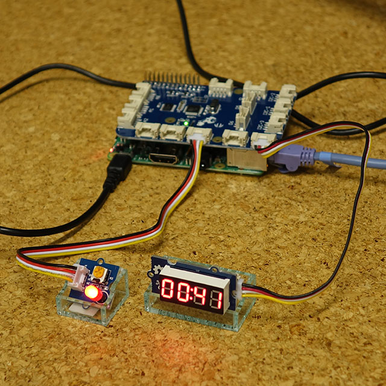

# Songle Sync Raspberry Pi向けslaveプロジェクト

Raspberry Piに接続されたLEDが拍に合わせて明滅し、4桁ディスプレイに再生時刻が表示されます。



## 必要なハードウェア

- [Raspberry Pi](https://www.raspberrypi.org/products/raspberry-pi-3-model-b/) (3 Model Bで動作確認しています)
- [GrovePi](https://www.dexterindustries.com/grovepi/) (Groveモジュールを繋ぐのに必要です)
- [Grove 4-Digit Displayモジュール](http://wiki.seeed.cc/Grove-4-Digit_Display/) (再生時刻表示に使います; GrovePi D2ピンに挿します)
- [Grove LEDモジュール](http://wiki.seeed.cc/Grove-LED_Socket_Kit/) (拍に合わせて明滅します; GrovePi D4ピンに挿します)

## 初期設定

GrovePiを使うには [チュートリアル](https://www.dexterindustries.com/GrovePi/get-started-with-the-grovepi/) に従ってGrovePiのGitHubリポジトリをcloneしてスクリプトを実行する必要があります。ただ、セットアップがうまくいかないこともあるので、 [Raspbian for Robots](https://www.dexterindustries.com/howto/install-raspbian-for-robots-image-on-an-sd-card/) をSDカードに焼いて使うのが簡単です。

よく売られている5インチLCDディスプレイをつないだ場合はドライバをインストールする必要もあります。（公式の7インチはドライバなしで正しく表示されます。）

```sh
git clone https://github.com/goodtft/LCD-show.git
chmod -R 755 LCD-show
cd LCD-show/
```

Node.jsをインストールするには以下を実行します。

```sh
curl -sL https://deb.nodesource.com/setup_6.x | sudo -E bash -
sudo apt install nodejs
```

## 一般的な使い方説明

以下のようにして実行してください。 `npm install` は最初の一度だけ必要です。

```sh
$ npm install
$ node index.js
```

実行時に `GrovePi is not connected.` というエラーが出る場合は `i2cdetect` コマンドを実行し、GrovePiを表す `04` が表示されていることを確認してください。

```sh
root@dex:/home/pi# i2cdetect -y 1
     0  1  2  3  4  5  6  7  8  9  a  b  c  d  e  f
00:          -- 04 -- -- -- -- -- -- -- -- -- -- --
10: -- -- -- -- -- -- -- -- -- -- -- -- -- -- -- --
20: -- -- -- -- -- -- -- -- -- -- -- -- -- -- -- --
30: -- -- -- -- -- -- -- -- -- -- -- -- -- -- -- --
40: -- -- -- -- -- -- -- -- -- -- -- -- -- -- -- --
50: -- -- -- -- -- -- -- -- -- -- -- -- -- -- -- --
60: -- -- -- -- -- -- -- -- -- -- -- -- -- -- -- --
70: -- -- -- -- -- -- -- --
```

`i2cdetect` の結果にGrovePiが表れない場合は、以下のコマンドを実行してGrovePiをリセットしてから再度試してください。

```sh
$ avrdude -c gpio -p m328p
```

なお、そもそもI2Cが有効になっていない場合は、以下のコマンドでRaspberry Piの設定画面を表示し、I2Cを有効にする必要があります。

```sh
$ sudo raspi-config
```

## ビルド方法の説明

`index.ts` はTypeScriptで書かれているので、 `tsc` コマンドを使ってビルドしてください。 `index.js` が上書きされます。

```sh
$ tsc
```

`tsc` がインストールされていない環境では、まず以下のようにしてインストールする必要があります。

```sh
$ npm install -g typescript
```
